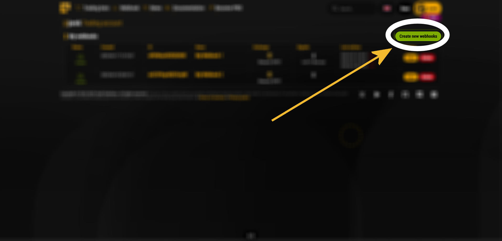
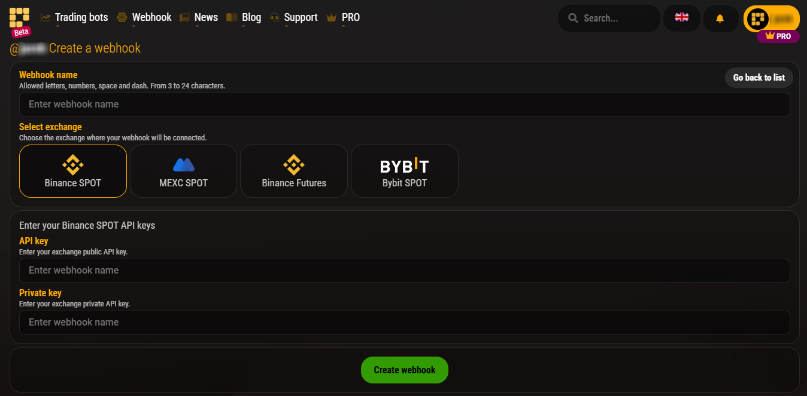

# Webhook Examples

This repository provides a collection of code examples demonstrating how to interact with a [Psyll webhook](https://psyll.com/en/webhok) endpoint using various programming languages. Each example performs a POST request to the webhook with a payload to execute a trading action, such as a "BUY" order for BTCUSDT. The examples are designed to be simple, reusable, and adaptable for various use cases, enabling developers to integrate trading functionality into their applications.

## Whats is webhook?

Webhook enable executing trades across exchanges through simple HTTP POST requests. They are ideal for automating complex trading strategies, allowing bot developers to seamlessly integrate trading logic, respond instantly to alerts, and embed trading functionality into any backend system for complete automation.

## Create a webhook on [Psyll.com](https://psyll.com/en/webhok)

1) Navigate to [Psyll.com](https://psyll.com/en/webhok) website
2) Login to your user account
3) Navigate to **"My Webhooks"** under the user menu (top-right corner)


4) Click **"Create new webook"**



5) Complete the form by providing:



- A unique webhook **name**.
- The **exchange** you wish to connect to.
- Valid **API keys** for the selected exchange.


## Limits
|Account type | Number of webhooks | Daily limits |
|--|--|--|
|**Free account** | 1 | 20 requests a day
|**PRO account** | 15 |  200 requests a day


# Webhook request

Request URL:

```
https://psyll.com/env/webhook/{WEBHOOK-ID}
```

Replace `{WEBHOOK-ID}` with the unique identifier provided when you created the webhook.

Request data

```json
{
  "code": "{WEBHOOK-CODE}",
  "action": "{ACTION}",
  "quantity": "{QUANTITY}",
  "symbol": "{SYMBOL}"
}
```


### Data descriptions

| Name | Type | Description |
| -------- | ------- | ------- |
| `code`| *string* |  unique authentication code required to validate the webhook request, ensuring secure access to the API. |
| `action` | *string* | Specifies the trading action to be performed.Allowed Values: "BUY", "SELL", "SET"
| `quantity` | *float* | Defines the amount of the asset to trade
| `symbol` | *string* | Identifies the trading pair or asset for the order. The symbol must match a valid trading pair supported by the exchange


# Webhook response

A successful webhook request returns a JSON response with the following structure:

```json
{
    "created": "2025-07-07 18:25:20",
    "limit": {
        "account": "PRO",
        "max_per_day": 200,
        "usage": 3
    },
    "message": "Order placed",
    "request": {
        "action": "SET",
        "code": "{WEBHOOK-CODE}",
        "quantity": "1",
        "symbol": "BTCUSDC"
    },
    "status": "success"
}

```

### Response Fields


| Field | Description |
|---|---|
`created` | Timestamp indicating when the request was processed.
`limit` | Object containing account tier, daily request limit, and current usage.
`message` | A brief description of the request outcome.
`request` | Echoes the submitted request data for verification.
`status` | Indicates the outcome of the request, e.g., "success" or "error".


## Error Handling

If a request fails, the response will include an error status and a descriptive message. Example:

```json
{
    "created": "2025-07-07 18:37:08",
    "limit": {
        "account": "PRO",
        "max_per_day": 200,
        "usage": 4
    },
    "message": "Account has insufficient balance for requested action.",
    "request": {
        "action": "SET",
        "code": "{WEBHOOK-CODE}",
        "quantity": "1",
        "symbol": "BTCUSDC"
    },
    "status": "error"
}
```

Ensure that the code, action, quantity, and symbol fields are valid to avoid errors.

#### Common Issues

- Incorrect or missing webhook code: Ensure the code field matches the webhook code provided by Psyll.
- Unsupported trading pair: Verify that the symbol is valid for the selected exchange.
- Invalid quantity format: Use a representation of a numeric value (e.g., "1.5") to maintain precision.
- Rate limit exceeded: Check the limit field in the response to monitor usage against the daily limit.


# Getting Started

1) Clone this repository to your local machine:
```
git clone https://github.com/username/webhook-examples.git
```
2) Navigate to the directory of the desired programming language.
3) Update the `WEBHOOK_URL` and `WEBHOOK_CODE` variables with your webhook ID and code.
4) Install any required dependencies (e.g., requests for Python, axios for Node.js).
5) Run the example script to test the webhook request.


# Programming languages

The repository includes example implementations in the following programming languages:

|     | Name | Folder |
| -------- | ------- | ------- |
|   | Python    | [View files]( https://github.com/psyll/Webhook-Examples/tree/main/python)
|  | C#     | [View files]( https://github.com/psyll/Webhook-Examples/tree/main/c)
|     | PHP    | [View files]( https://github.com/psyll/Webhook-Examples/tree/main/php)
|     | JavaScript    | [View files]( https://github.com/psyll/Webhook-Examples/tree/main/javascript)
|     | NodeJS    | [View files]( https://github.com/psyll/Webhook-Examples/tree/main/ndoejs)
|     | Go    | [View files]( https://github.com/psyll/Webhook-Examples/tree/main/go)
|     | Java    | [View files]( https://github.com/psyll/Webhook-Examples/tree/main/java)
|     | Kotlin    | [View files]( https://github.com/psyll/Webhook-Examples/tree/main/kotlin)
|     | Ruby    | [View files]( https://github.com/psyll/Webhook-Examples/tree/main/ruby)
|     | Rust    | [View files]( https://github.com/psyll/Webhook-Examples/tree/main/rust)
|     | Swift    | [View files]( https://github.com/psyll/Webhook-Examples/tree/main/swift)
|     | TypeScript    | [View files]( https://github.com/psyll/Webhook-Examples/tree/main/typescript)


# Security Best Practices

- **Secure Webhook Code:** Store WEBHOOK_CODE in environment variables or a secure configuration file, not in source code.
- **Validate Responses:** Always check the status field in the response to confirm the request outcome.
- **Monitor Rate Limits:** Use the limit field to track daily usage and avoid exceeding quotas.
- **Use HTTPS:** Ensure all requests are sent over HTTPS to protect sensitive data.

# Troubleshooting

- **Connection Errors:** Verify that WEBHOOK_URL is correct and accessible.
- **Invalid Payload:** Double-check the format and values of code, action, quantity, and symbol.
- **Authentication Issues:** Confirm that the WEBHOOK_CODE matches the code provided by Psyll.
- **Exchange-Specific Errors:** Ensure the selected exchange supports the specified symbol and that your API keys have the necessary permissions.


# Additional Resources

- [**Psyll Homepage**](https://psyll.com/en) - Psyll homepage
- [**Psyll Webhook Homepage**](https://psyll.com/en/webhok) - Psyll webhook page
- [**Webhook documentation**](https://psyll.com/en/documentation/webhook) - Psylls's webhook documentation pages


# Contributing

Contributions are welcome ❤️ To contribute:

1) Fork the repository.
2) Create a new branch for your changes `git checkout -b feature/new-example`)`.
3) Commit your changes with a clear message `git commit -m "Add example for <language>"`)`.
4) Submit a pull request with a detailed description of your changes.

Please ensure your code adheres to the repository's style guidelines and includes appropriate documentation.

# License

This project is licensed under the MIT License. See the LICENSE file for details.


